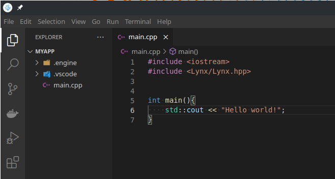

# Lynx Engine

A 3D software engine with volume rendering and advanced physics.
 The engine features:

- Ray tracing volume rendering
  - No textures or UVs required
  - Better performance in physics simulations
  - Runtime destruction physics
  - High quality renders

- Node-based runtime procedural object generation
  - Minimal disk usage
  - Short loading time
  - Multiple outputs from a single object

- Global thread pool
- Per-thread memory pool
- Global VRAM pool

 //TODO add cool images
 
 
 
 

# Getting started

<b>Software requirements</b>

The engine is meant to be used on Linux systems only.
 We do not provide any support for developement on Windows or MacOS.

| Software     | Version   |
|--------------|-----------|
| Linux        | 4.4       |
| g++          | 11.1.1    |
| glslang      | 10:11.0.0 |
| spirv-tools  | 2020.7    |

 

<b>Install the required packages</b>

Some softwares and libraries are required in order to build applications with the engine.
 You can install them with those commands:
 
 Fedora:
 <code>sudo dnf install gcc-c++ glslang spirv-tools</code>
 <code>sudo dnf install vulkan-devel glfw-devel libX11-devel libXcursor-devel libXrandr-devel libXinerama-devel libXi-devel freeglut-devel libasan libubsan</code>
 
 Arch:
 <code>sudo pacman -S gcc glslang</code>
 <code>sudo pacman -S vulkan-devel glfw-x11 libx11 libxcursor libxrandr libxinerama libxi freeglut gcc-libs</code>
 //TODO add software for wayland
 
 Additionally, Windows builds require the mingw executable
 //TODO add mingw commands
 
 

<b>Download the LynxEngine SDK</b>

Clone the repository from GitHub: 
<code>git clone https://github.com/Edo022/Lynx.git</code>

 
 
 
 

# Build applications

<b>Application project structure</b>

The minimal application project contains one source file and a generated .engine directory.
 The .engine directory is used to build the application and is generated when linking the project to an SDK.
 An application project can be linked to the SDK by running its Setup script:
 
 <code>mkdir MyApp; cd MyApp</code>
 <code>touch main.cpp</code> //TODO add an option to the setup script to make it generate a main.cpp
 <code>&lt;path_to_sdk&gt;/Tools/Setup/Setup -vsc</code>
 <code>code .</code>
 
 The -vsc option tells the setup script to generate configuration files for Visual Studio Code.
 Support for other editors will be added in future versions.

 //TODO update image. use a rendered output for the hello world
 //TODO link to include paths details
 The source file must define a main function, like any C++ program.
 
 

<b>Build system</b>

Applications are built using the <code>&lt;path_to_sdk&gt;/Tools/Build/Build</code> executable, which is an <a href="https://github.com/d-Qw4w9WgXc-Q/Alloy">Alloy</a> wrapper that parses the provided arguments, adds everything the engine needs and forwards them to the build system.
 The source files and other flags can be specified in the <code>.engine/Build.Application</code> file. See //TODO link to syntax details
 
 //TODO show vscode build tasks
 The Build executable allows 2 build configurations:

- Debug  
  - The code is not optimized and contains any available debug, gdb and gprof information.
  - The engine enables Vulkan validation layers and Lynx runtime validation tests.  
    Any error reported by those systems must be fixed before shipping, as they indicate a bug in the application.  
  - Additional tools and key bindings are built into your application to help debugging it

- Release  
  - The code is optimized for speed by using <code>-Ofast</code> and other compiler specific options and contains no debug informations.
  - No validation layers, no runtime tests.
 
 Selectors can be used to enable different arguments based on the target platform and active configuration.
 See <code>&lt;path_to_sdk&gt;/Tools/Build/Build -h</code> for more informations.
 
 e.g. <code>&lt;path_to_sdk&gt;/Tools/Build/Build -m=ld -r: -O3 -g0 -d: -O0 -g3 -a: main.cpp</code>
//TODO RENAME LYNXG++ AS "Build"
 Examples are located in <code>&lt;path_to_sdk&gt;/Examples/</code> and contain the source code, the executable and the commands used to build it.

 
 
 
 

# Configure and modify an SDK

//TODO
The same system can use multiple versions of the SDK.

Each version can be used by multiple applications at the same time.  
Any modification to a version will affect all the applications linked to it.
 
 
 
 

# Support the developers

uwu
